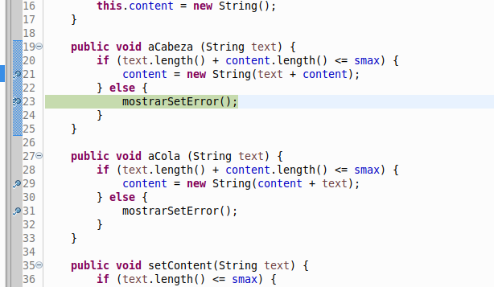
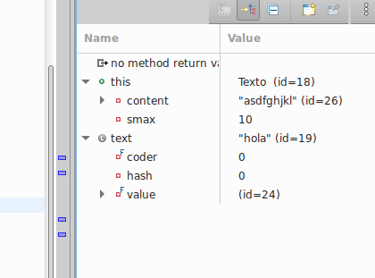
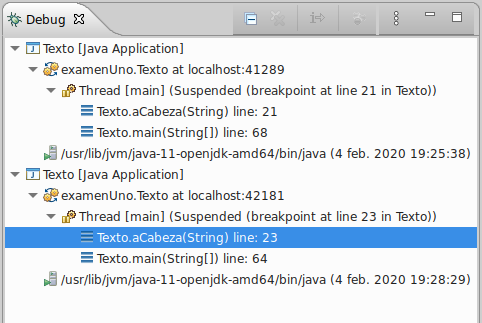
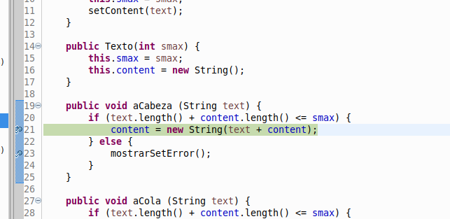
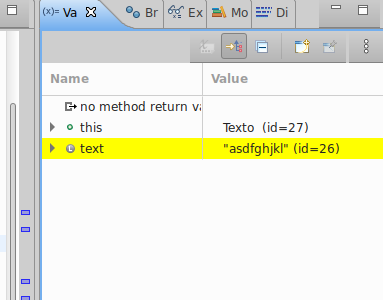

Depuración usando Eclipse
-------------------------

> Depuración del proyecto `STexto` usando las herramientas del paquete Eclipse.  
Por Miguel Bautista
 
  
- _Toogle Breakpoint_

  
- _Mostrando los valores de las variables para encontrar el error._   

  
- _Mostrando los diferentes threads en ejecución_

  
- _Diferentes pruebas_

  
- _Localizando el error_

Vemos que lo que sucede en este caso es que estamos tratando de concatenar `"asdfghjkl"` con `"hola"`, cuando el tamaño máximo `smax` de nuestra cadena de carácteres es 10. Esta operación es la que está causando el error.

Para solucionarlo bastaría con aumentar el tamaño máximo `smax` o crear un método que tome solo los carácteres que van a caber en el array.